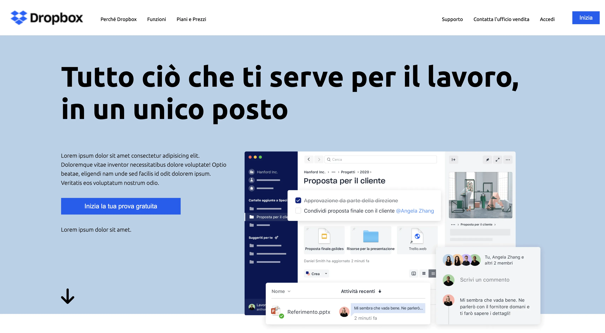

# 💾 Dropbox – Replica HTML & CSS

> [NOTE!]
> Riproduzione a scopo di esercitazione.

Un progetto di ricreazione **frontend** ispirato alla homepage ufficiale di [Dropbox](https://www.dropbox.com).  
Realizzato con **HTML5** e **CSS3** per esercitare la struttura semantica, la gestione dei layout moderni (Flexbox/Grid) e le pratiche di design responsive.

---

## 🎯 Obiettivo del progetto

L’obiettivo è **riprodurre fedelmente il layout** e le principali sezioni visive del sito originale di Dropbox, mantenendo pulizia, coerenza tipografica e un approccio scalabile al codice CSS.

Questo progetto è stato pensato come esercizio professionale per consolidare:

- La gestione del layout tramite **Flexbox e Grid**
- L’utilizzo di **variabili CSS e colori coerenti**
- Le **regole BEM** per un CSS modulare e manutenibile
- La creazione di un **design responsive** per desktop, tablet e mobile
- L’attenzione ai dettagli visivi: spaziatura, contrasto e leggibilità

---

## 🖼️ Anteprima

---

## 💡 Tecnologie utilizzate

- **HTML5** – Struttura semantica e accessibile
- **CSS3** – Layout responsive, variabili e pseudo-elementi
- **Google Fonts** – Tipografia moderna
- **Flexbox / Grid** – Gestione delle sezioni e dei contenuti

---

## 📱 Design responsivo

✅ Desktop  
✅ Tablet  
✅ Mobile

L’interfaccia si adatta automaticamente grazie a **media query ottimizzate** e layout fluidi.
